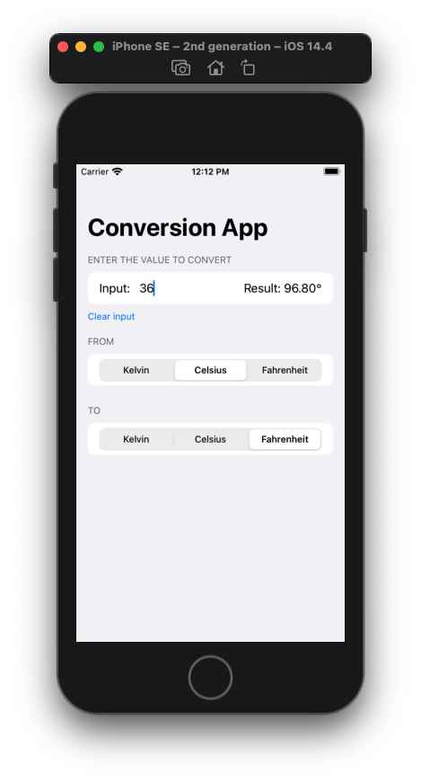
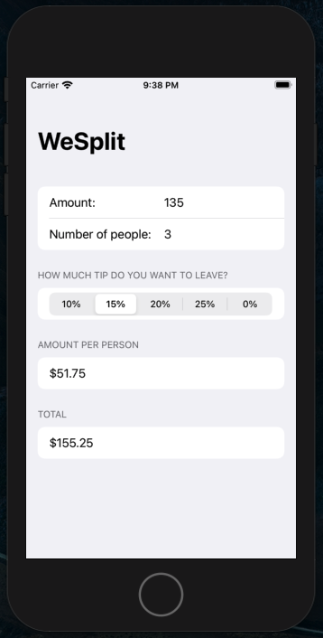
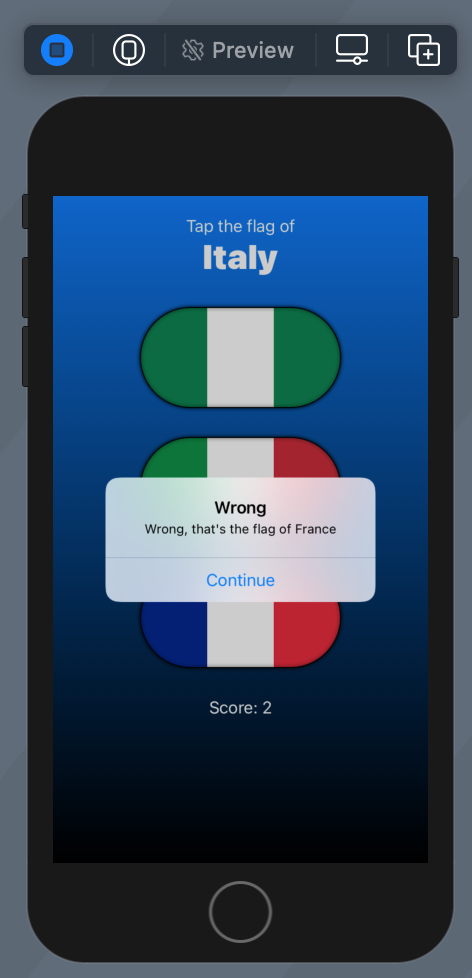
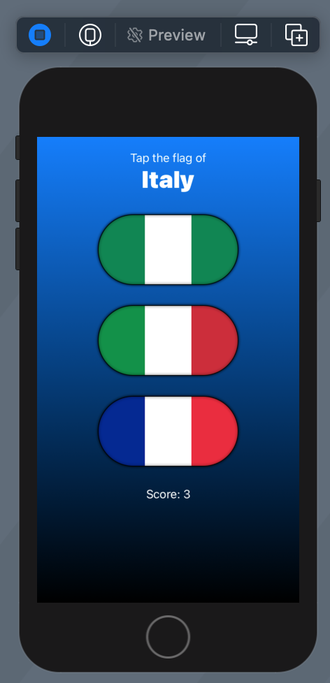
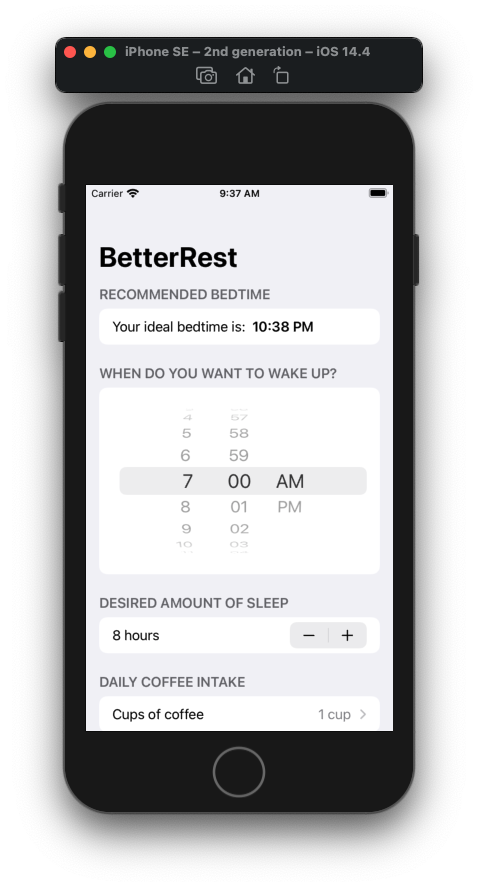
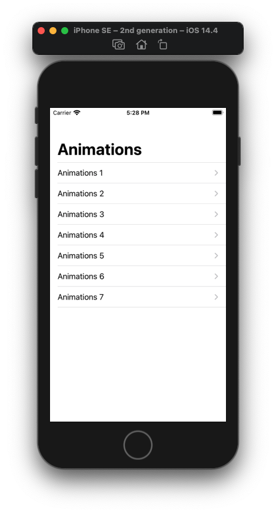

# MY REPO OF ALL THE HACKING WITH SWIFTUI PROJECTS

## Challenges

#### **_Finish Challenges - WeSplit_**

*The challenge was to create a simple app to convert temperature units using the knowledge from the previous project*

___
#### **_Finish Milestone (Projects 1-3)_**

*The challenge was to create a brain trainning game that challenges players to win or lose at rock, paper, scissors*

* _Each turn of the game the app will randomly pick either rock, paper, or scissors._
* _Each turn the app will either prompt the player to win or lose._
* _The player must then tap the correct move to win or lose the game._
* _If they are correct they score a point; otherwise they lose a point._
* _The game ends after 10 questions, at which point their score is shown._

___

___
## Projects 

#### **_Finish project 1 - WeSplit_**

*Simple app to introduce SwiftUI*
*Topics covered:*

* _@State property_
* _TextField_
* _Picker_
* _ForEach_

___    
#### **_Finish project 2 - Guess the Flag_**

*Simple game to gues the right flag*
*Topics covered:*

* _VStack, HStack, ZStack_
* _Image_
* _Alert_

___

___    
#### **_Finish project 4 - BetterRest_**

*App that helps coffee drinkers get a good night’s sleep by asking them some questions*
*Topics covered:*

* _Core ML_
* _Date, DatePicker, DateComponents and DateFormatter_
* _Stepper_
* _navigationBarItems_

___    
#### **_Finish project 5 - WordScramble_**

*Game that shows players a random eight-letter word, and ask them to make words out of it*
*Topics covered:*

* _List_
* _Bundle_
* _onAppear_
* _UITextChecker_

 ___ 

___    
#### **_Finish project 6 - Animations_**

*A whole chapter about the power of Animations*
*Topics covered:*

* _Animations_

 ___ 

___    

